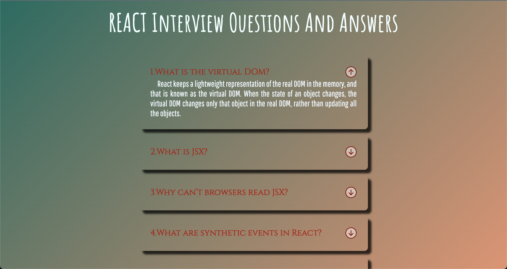

# React Interview QA Accord App

## Description

Built an accordion app to test yourself with react interview questions.When you click on the arrow mark you will see the answer.

### Topics are to be covered;

- HTML, CSS, JS, React

## Project Skeleton

```
Interview-Accord-App (folder)
|       
├── public
│     ├── img
│     └── index.html
├── src
│   ├── App.css
│   ├── App.js
│   ├── components
│   │   ├── Question.jsx
│   │   └── InterviewAccord.jsx
│   ├── helper
│   │   ├── data.js
│   │   └── icons.js
│   └── index.js
├── .gitignore
├── package.json
├── readme.md
└── yarn.lock

```

## Expected Outcome

**<div align="center"></div>**

**<p align="center">&#9786; Happy Coding &#9997;</p>**
